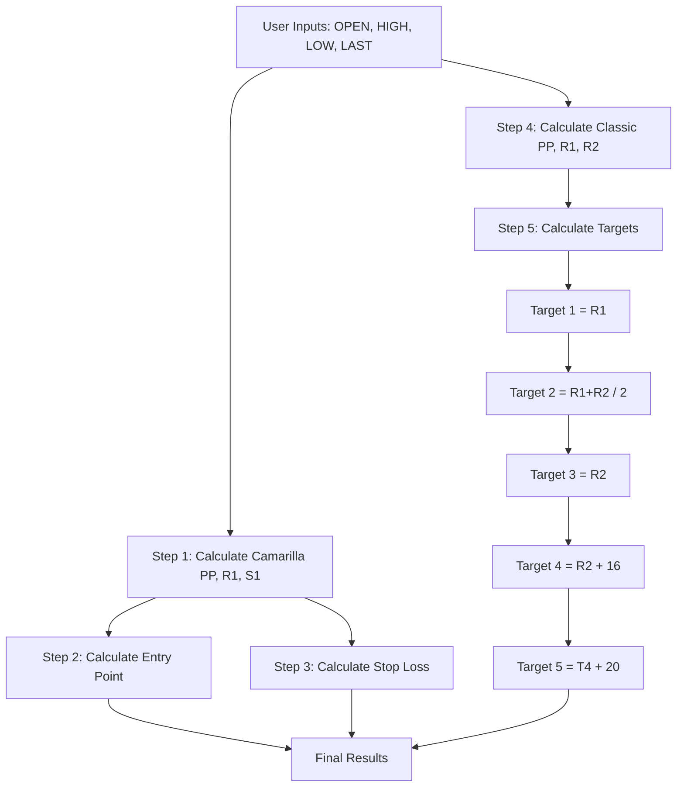
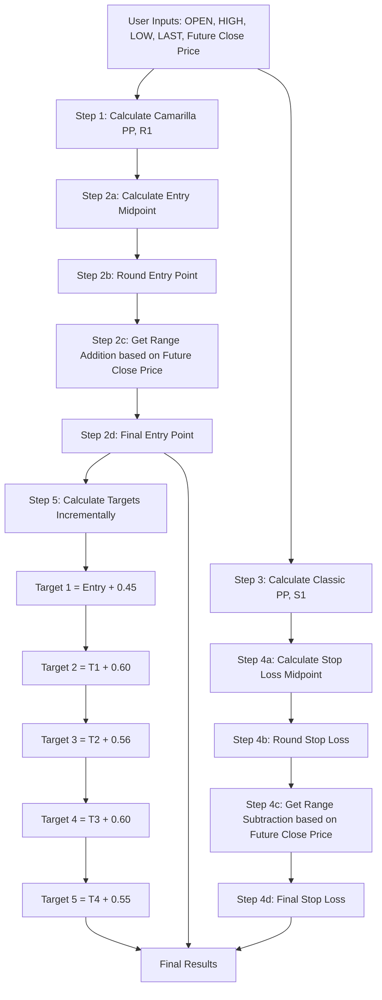

# Pivot Point Calculator - Complete Calculation Flow Documentation

## Overview

This document provides a comprehensive explanation of how the Pivot Point Calculator works for both **NIFTY Options** and **Stock Options** tabs. It includes step-by-step calculation flows, formulas, examples, and visual diagrams.

The calculator uses two different pivot point calculation methods:
- **Camarilla Method**: Used for Entry Point and Stop Loss calculations
- **Classic Method**: Used for Target calculations

---

## NIFTY Options Tab - Complete Calculation Flow

### Input Fields

The NIFTY Options tab requires the following inputs:

- **OPEN**: Opening price (required)
- **HIGH**: Highest price (required)
- **LOW**: Lowest price (required)
- **LAST**: Last/closing price (required)

### Calculation Flow Diagram



### Step-by-Step Calculation Process

#### Step 1: Calculate Camarilla Pivot Points (for Entry Point & Stop Loss)

**Purpose**: Calculate pivot point and resistance/support levels using the Camarilla method.

**Formulas**:
```
Range = HIGH - LOW
Pivot Point (PP) = (HIGH + LOW + LAST) / 3

Resistance Levels:
R1 = LAST + (Range × 1.1) / 12
R2 = LAST + (Range × 1.1) / 6
R3 = LAST + (Range × 1.1) / 4
R4 = LAST + (Range × 1.1) / 2

Support Levels:
S1 = LAST - (Range × 1.1) / 12
S2 = LAST - (Range × 1.1) / 6
S3 = LAST - (Range × 1.1) / 4
S4 = LAST - (Range × 1.1) / 2
```

**Example**:
- HIGH = 150.00
- LOW = 140.00
- LAST = 148.00

```
Range = 150.00 - 140.00 = 10.00
PP = (150.00 + 140.00 + 148.00) / 3 = 146.00

R1 = 148.00 + (10.00 × 1.1) / 12 = 148.00 + 0.9167 = 148.9167
S1 = 148.00 - (10.00 × 1.1) / 12 = 148.00 - 0.9167 = 147.0833
```

**Note**: For NIFTY calculations, we only use PP, R1, and S1 from Camarilla.

---

#### Step 2: Calculate Entry Point

**Purpose**: Determine the entry point for buying.

**Formula**:
```
Entry Midpoint = (Camarilla PP + Camarilla R1) / 2
Entry Point = RoundUp(Entry Midpoint) + 20
```

**Rounding**: `RoundUp()` always rounds UP to the nearest integer (ceiling function).

**Example**:
```
Entry Midpoint = (146.00 + 148.9167) / 2 = 147.45835
RoundUp(147.45835) = 148
Entry Point = 148 + 20 = 168
```

**Key Points**:
- Always rounds up to nearest integer
- Fixed addition of 20 points
- Uses Camarilla PP and R1

---

#### Step 3: Calculate Stop Loss

**Purpose**: Determine the stop loss level for selling.

**Formula**:
```
Stop Loss Midpoint = (Camarilla PP + Camarilla S1) / 2
Stop Loss = RoundUp(Stop Loss Midpoint) - 2
```

**Rounding**: `RoundUp()` always rounds UP to the nearest integer (ceiling function).

**Example**:
```
Stop Loss Midpoint = (146.00 + 147.0833) / 2 = 146.54165
RoundUp(146.54165) = 147
Stop Loss = 147 - 2 = 145
```

**Key Points**:
- Always rounds up to nearest integer
- Fixed subtraction of 2 points
- Uses Camarilla PP and S1

---

#### Step 4: Calculate Classic Pivot Points (for Targets)

**Purpose**: Calculate pivot point and resistance levels using the Classic method for target calculations.

**Formulas**:
```
Range = HIGH - LOW
Pivot Point (PP) = (HIGH + LOW + LAST) / 3

Resistance Levels:
R1 = 2 × PP - LOW
R2 = PP + RANGE
R3 = PP + RANGE × 2
R4 = PP + RANGE × 3

Support Levels:
S1 = 2 × PP - HIGH
S2 = PP - RANGE
S3 = PP - RANGE × 2
S4 = PP - RANGE × 3
```

**Example**:
```
Range = 150.00 - 140.00 = 10.00
PP = (150.00 + 140.00 + 148.00) / 3 = 146.00

R1 = 2 × 146.00 - 140.00 = 152.00
R2 = 146.00 + 10.00 = 156.00
```

**Note**: For NIFTY target calculations, we only use R1 and R2 from Classic.

---

#### Step 5: Calculate Targets

**Purpose**: Calculate five target levels for profit-taking.

**Formulas**:
```
Target 1 = R1 (Classic)
Target 2 = (R1 + R2) / 2
Target 3 = R2 (Classic)
Target 4 = R2 + 16
Target 5 = Target 4 + 20
```

**Important**: All target calculations use **exact values** with NO rounding. Rounding only occurs in display formatting.

**Example**:
```
Target 1 = 152.00
Target 2 = (152.00 + 156.00) / 2 = 154.00
Target 3 = 156.00
Target 4 = 156.00 + 16 = 172.00
Target 5 = 172.00 + 20 = 192.00
```

**Key Points**:
- Target 1 and Target 3 are direct Classic pivot point values
- Target 2 is the exact mathematical midpoint between R1 and R2
- Target 4 and Target 5 use fixed increments (16 and 20)

---

### Complete NIFTY Example

**Input Values**:
- OPEN: 145.00
- HIGH: 150.00
- LOW: 140.00
- LAST: 148.00

**Step 1: Camarilla Calculation**
```
Range = 10.00
PP = 146.00
R1 = 148.9167
S1 = 147.0833
```

**Step 2: Entry Point**
```
Entry Midpoint = 147.45835
Entry Point = 168
```

**Step 3: Stop Loss**
```
Stop Loss Midpoint = 146.54165
Stop Loss = 145
```

**Step 4: Classic Calculation**
```
PP = 146.00
R1 = 152.00
R2 = 156.00
```

**Step 5: Targets**
```
Target 1 = 152.00
Target 2 = 154.00
Target 3 = 156.00
Target 4 = 172.00
Target 5 = 192.00
```

**Final Results**:
- Entry Point: 168
- Stop Loss: 145
- Target 1: 152.00
- Target 2: 154.00
- Target 3: 156.00
- Target 4: 172.00
- Target 5: 192.00

---

## Stock Options Tab - Complete Calculation Flow

### Input Fields

The Stock Options tab requires the following inputs:

- **OPEN**: Opening price (required)
- **HIGH**: Highest price (required)
- **LOW**: Lowest price (required)
- **LAST**: Last/closing price (required)
- **Stock Name**: Text field (optional, for reference)
- **Future Close Price**: Number field (required for calculations)

### Calculation Flow Diagram



### Step-by-Step Calculation Process

#### Step 1: Calculate Camarilla Pivot Points (for Entry Point)

**Purpose**: Calculate pivot point and resistance levels using the Camarilla method.

**Formulas**: Same as NIFTY Step 1
```
Range = HIGH - LOW
PP = (HIGH + LOW + LAST) / 3
R1 = LAST + (Range × 1.1) / 12
```

**Note**: For Stock Options Entry Point, we only use PP and R1 from Camarilla.

---

#### Step 2: Calculate Entry Point

**Purpose**: Determine the entry point with custom rounding and range-based adjustments.

**Formula**:
```
Entry Midpoint = (Camarilla PP + Camarilla R1) / 2
Rounded Midpoint = RoundEntryPoint(Entry Midpoint)
Range Addition = GetEntryPointRangeAddition(Future Close Price)
Entry Point = Rounded Midpoint + Range Addition
```

##### Step 2a: Calculate Entry Midpoint
```
Entry Midpoint = (PP + R1) / 2
```

##### Step 2b: Round Entry Point

**Custom Rounding Rules** (based on last decimal digit - hundredths place):

| Last Digit | Rule | Example |
|------------|------|---------|
| 0 | Keep as is | 1.00 → 1.00, 1.10 → 1.10 |
| 1-4 | Round up to 5 | 1.74 → 1.75, 1.81 → 1.85, 1.01 → 1.05 |
| 5 | Keep as is | 1.75 → 1.75 |
| 6-9 | Round up to next 0 | 1.56 → 1.60, 1.89 → 1.90, 1.06 → 1.10 |

**Examples**:
- 1.74 → 1.75 (last digit 4 → round up to 5)
- 1.81 → 1.85 (last digit 1 → round up to 5)
- 1.56 → 1.60 (last digit 6 → round up to next 0)
- 1.89 → 1.90 (last digit 9 → round up to next 0)

##### Step 2c: Get Range Addition (based on Future Close Price)

**Range Table** (based on **Future Close Price** value):

| Future Close Price Range | Addition |
|-------------------------|----------|
| 1 - 400 | +0.40 |
| 401 - 2000 | +0.60 |
| 2001 - 3500 | +1.60 |
| 3501 - 5500 | +3.40 |
| 5501 - 10000 | +5.80 |

**Important**: The range addition is determined by the **Future Close Price**, not the rounded midpoint.

##### Step 2d: Calculate Final Entry Point
```
Entry Point = Rounded Midpoint + Range Addition
```

**Example**:
```
Entry Midpoint = 147.45835
Rounded Midpoint = 147.50 (last digit 8 → round up to next 0)
Future Close Price = 150
Range Addition = 0.40 (Future Close Price 150 is in range 1-400)
Entry Point = 147.50 + 0.40 = 147.90
```

---

#### Step 3: Calculate Classic Pivot Points (for Stop Loss)

**Purpose**: Calculate pivot point and support levels using the Classic method.

**Formulas**: Same as NIFTY Step 4
```
Range = HIGH - LOW
PP = (HIGH + LOW + LAST) / 3
S1 = 2 × PP - HIGH
```

**Note**: For Stock Options Stop Loss, we only use PP and S1 from Classic.

---

#### Step 4: Calculate Stop Loss

**Purpose**: Determine the stop loss level with custom rounding and range-based adjustments.

**Formula**:
```
Stop Loss Midpoint = (Classic PP + Classic S1) / 2
Rounded Midpoint = RoundStopLoss(Stop Loss Midpoint)
Range Subtraction = GetStopLossRangeSubtraction(Future Close Price)
Stop Loss = Rounded Midpoint - Range Subtraction
```

##### Step 4a: Calculate Stop Loss Midpoint
```
Stop Loss Midpoint = (PP + S1) / 2
```

##### Step 4b: Round Stop Loss

**Custom Rounding Rules** (based on last decimal digit - hundredths place):

| Last Digit | Rule | Example |
|------------|------|---------|
| 0 | Keep as is | 1.00 → 1.00, 1.10 → 1.10 |
| 1-4 | Round down to 0 | 1.71 → 1.70, 1.83 → 1.80 |
| 5 | Keep as is | 1.75 → 1.75 |
| 6-9 | Round down to 5 | 1.76 → 1.75, 1.89 → 1.85 |

**Examples**:
- 1.71 → 1.70 (last digit 1 → round down to 0)
- 1.83 → 1.80 (last digit 3 → round down to 0)
- 1.76 → 1.75 (last digit 6 → round down to 5)
- 1.89 → 1.85 (last digit 9 → round down to 5)

##### Step 4c: Get Range Subtraction (based on Future Close Price)

**Range Table** (based on **Future Close Price** value):

| Future Close Price Range | Subtraction |
|-------------------------|-------------|
| 1 - 400 | -1.50 |
| 401 - 2000 | -2.00 |
| 2001 - 3500 | -5.60 |
| 3501 - 5500 | -7.40 |
| 5501 - 10000 | -9.90 |

**Important**: The range subtraction is determined by the **Future Close Price**, not the rounded midpoint.

##### Step 4d: Calculate Final Stop Loss
```
Stop Loss = Rounded Midpoint - Range Subtraction
```

**Example**:
```
Stop Loss Midpoint = 146.50
Rounded Midpoint = 146.50 (last digit 0 → keep as is)
Future Close Price = 150
Range Subtraction = 1.50 (Future Close Price 150 is in range 1-400)
Stop Loss = 146.50 - 1.50 = 145.00
```

---

#### Step 5: Calculate Targets (Incremental from Entry Point)

**Purpose**: Calculate five target levels incrementally from the Entry Point.

**Important**: Stock Options targets are **NOT** based on Classic pivot points. They are calculated **incrementally** from the Entry Point.

**Formulas**:
```
Target 1 = Entry Point + 0.45
Target 2 = Target 1 + 0.60
Target 3 = Target 2 + 0.56
Target 4 = Target 3 + 0.60
Target 5 = Target 4 + 0.55
```

**Key Points**:
- Each target builds on the previous target
- The increments are fixed values (0.45, 0.60, 0.56, 0.60, 0.55)
- No rounding is applied to target calculations
- Display formatting may round values in the UI, but calculations use exact values

**Example**:
```
Entry Point = 147.90

Target 1 = 147.90 + 0.45 = 148.35
Target 2 = 148.35 + 0.60 = 148.95
Target 3 = 148.95 + 0.56 = 149.51
Target 4 = 149.51 + 0.60 = 150.11
Target 5 = 150.11 + 0.55 = 150.66
```

---

### Complete Stock Options Example

**Input Values**:
- OPEN: 145.00
- HIGH: 150.00
- LOW: 140.00
- LAST: 148.00
- Future Close Price: 150.00

**Step 1: Camarilla Calculation**
```
Range = 10.00
PP = 146.00
R1 = 148.9167
```

**Step 2: Entry Point**
```
Entry Midpoint = 147.45835
Rounded Midpoint = 147.50
Future Close Price = 150.00
Range Addition = 0.40 (Future Close Price 150 is in range 1-400)
Entry Point = 147.50 + 0.40 = 147.90
```

**Step 3: Classic Calculation**
```
Range = 10.00
PP = 146.00
S1 = 2 × 146.00 - 150.00 = 142.00
```

**Step 4: Stop Loss**
```
Stop Loss Midpoint = (146.00 + 142.00) / 2 = 144.00
Rounded Midpoint = 144.00
Future Close Price = 150.00
Range Subtraction = 1.50 (Future Close Price 150 is in range 1-400)
Stop Loss = 144.00 - 1.50 = 142.50
```

**Step 5: Targets**
```
Target 1 = 147.90 + 0.45 = 148.35
Target 2 = 148.35 + 0.60 = 148.95
Target 3 = 148.95 + 0.56 = 149.51
Target 4 = 149.51 + 0.60 = 150.11
Target 5 = 150.11 + 0.55 = 150.66
```

**Final Results**:
- Entry Point: 147.90
- Stop Loss: 142.50
- Target 1: 148.35
- Target 2: 148.95
- Target 3: 149.51
- Target 4: 150.11
- Target 5: 150.66

---

## Key Differences: NIFTY vs Stock Options

| Aspect | NIFTY Options Tab | Stock Options Tab |
|--------|-------------------|-------------------|
| **Entry Point Method** | Camarilla | Camarilla |
| **Entry Point Rounding** | `RoundUp()` (always round up to integer) | Custom `roundEntryPoint()` (rounds to .00, .05, .10) |
| **Entry Point Adjustment** | +20 (fixed) | Range-based addition (0.40 to 5.80) based on Future Close Price |
| **Stop Loss Method** | Camarilla (uses S1) | Classic (uses S1) |
| **Stop Loss Rounding** | `RoundUp()` (always round up to integer) | Custom `roundStopLoss()` (rounds to .00, .05, .10) |
| **Stop Loss Adjustment** | -2 (fixed) | Range-based subtraction (1.50 to 9.90) based on Future Close Price |
| **Targets Method** | Classic (R1, R2) | Incremental (from Entry Point) |
| **Target Calculation** | Based on Classic R1/R2 | T1 = Entry + 0.45, then incremental |
| **Future Close Price** | Not used | Required for range lookup |

---

## Summary

### NIFTY Options Tab
- Uses **Camarilla** method for Entry Point and Stop Loss
- Uses **Classic** method for Targets
- Simple rounding (always round up to integer)
- Fixed adjustments (+20 for Entry, -2 for Stop Loss)
- Targets based on Classic pivot points

### Stock Options Tab
- Uses **Camarilla** method for Entry Point
- Uses **Classic** method for Stop Loss
- Uses **Incremental** method for Targets (from Entry Point)
- Custom rounding rules (rounds to .00, .05, .10)
- Range-based adjustments (based on Future Close Price)
- Targets calculated incrementally from Entry Point
- **Future Close Price is required** for range-based adjustments

---

## Notes

1. **Precision**: All calculations use exact values. Rounding only occurs in display formatting.

2. **Future Close Price**: In Stock Options tab, Future Close Price is used to determine range-based additions/subtractions for Entry Point and Stop Loss.

3. **Target Dependencies**: 
   - NIFTY targets depend on Classic R1 and R2
   - Stock Options targets depend on Entry Point (each builds on previous)

4. **Method Separation**: Entry Point and Stop Loss use different pivot point methods in Stock Options (Camarilla for Entry, Classic for Stop Loss).

---

*Document Version: 1.0*  
*Last Updated: 2024*

