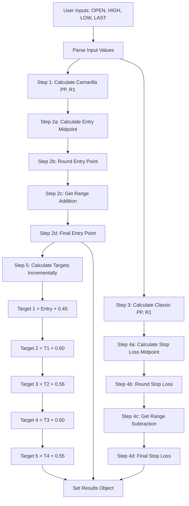

# Stock Tab Calculation Documentation

## Overview

This document provides a complete explanation of how the Stock Options tab calculations work in the pivot point calculator. It includes step-by-step flows, formulas, rounding rules, range-based adjustments, and example walkthroughs.

## File Location

All calculations are implemented in:
- **File**: `magic/src/app/folder/folder.page.ts`
- **Component**: `FolderPage`

---

## Input Fields

The Stock Options tab accepts the following inputs:

- **OPEN**: Opening price (required)
- **HIGH**: Highest price (required)
- **LOW**: Lowest price (required)
- **LAST**: Last/closing price (required)
- **Stock Name**: Text field (optional, for reference only)
- **Future Close Price**: Number field (optional, for reference only)

---

## Calculation Flow Diagram



---

## Step-by-Step Calculation Flow

### Step 1: Calculate Camarilla Pivot Points (for Entry Point)

**Code Location**: ```134:150:magic/src/app/folder/folder.page.ts```

**Method**: `calculateCamarillaPivotPoints(high, low, last)`

**Formulas**:
```typescript
Range = HIGH - LOW
PP = (HIGH + LOW + LAST) / 3

R1 = LAST + (Range × 1.1) / 12
R2 = LAST + (Range × 1.1) / 6
R3 = LAST + (Range × 1.1) / 4
R4 = LAST + (Range × 1.1) / 2

S1 = LAST - (Range × 1.1) / 12
S2 = LAST - (Range × 1.1) / 6
S3 = LAST - (Range × 1.1) / 4
S4 = LAST - (Range × 1.1) / 2
```

**Returns**: `{ pp, r1, r2, r3, r4, s1, s2, s3, s4 }`

**Note**: For Stock Options, we only use `pp` and `r1` from Camarilla calculations.

---

### Step 2: Calculate Entry Point

**Code Location**: ```305:318:magic/src/app/folder/folder.page.ts```

**Method**: `calculateStockEntryPoint(camarillaPP, camarillaR1)`

#### Step 2a: Calculate Entry Midpoint

```typescript
Entry Midpoint = (Camarilla PP + Camarilla R1) / 2
```

#### Step 2b: Round Entry Point

**Code Location**: ```209:239:magic/src/app/folder/folder.page.ts```

**Method**: `roundEntryPoint(value)`

The rounding logic is based on the **last decimal digit** (hundredths place):

| Last Digit | Rule | Example |
|------------|------|---------|
| 0 | Keep as is | 1.00 → 1.00, 1.10 → 1.10 |
| 1-4 | Round up to 5 | 1.74 → 1.75, 1.81 → 1.85, 1.01 → 1.05 |
| 5 | Keep as is | 1.75 → 1.75, 1.5 → 1.5 |
| 6-9 | Round up to next 0 | 1.56 → 1.60, 1.89 → 1.90, 1.06 → 1.10 |

**Detailed Rounding Examples**:

| Input | Last Digit | Output | Explanation |
|-------|------------|--------|-------------|
| 1.00 | 0 | 1.00 | Already rounded to .00 |
| 1.01 | 1 | 1.05 | Round up to 5 |
| 1.06 | 6 | 1.10 | Round up to next 0 |
| 1.74 | 4 | 1.75 | Round up to 5 |
| 1.75 | 5 | 1.75 | Keep as is |
| 1.81 | 1 | 1.85 | Round up to 5 |
| 1.89 | 9 | 1.90 | Round up to next 0 |

#### Step 2c: Get Range-Based Addition

**Code Location**: ```273:287:magic/src/app/folder/folder.page.ts```

**Method**: `getEntryPointRangeAddition(midpoint)`

Based on the **rounded midpoint value**, add the following:

| Midpoint Range | Addition | Notes |
|----------------|----------|-------|
| 1 - 400 | +0.40 paise (0.0040) | Small addition |
| 401 - 2000 | +0.60 paise (0.0060) | Small addition |
| 2001 - 3500 | +1.20 rs | Medium addition |
| 3501 - 5000 | +2.40 rs | Large addition |
| 5001 - 8000 | +4.30 rs | Very large addition |

**Important**: The range is determined by the **rounded midpoint**, not the original midpoint.

#### Step 2d: Calculate Final Entry Point

```typescript
Final Entry Point = Rounded Midpoint + Range Addition
```

---

### Step 3: Calculate Classic Pivot Points (for Stop Loss)

**Code Location**: ```152:171:magic/src/app/folder/folder.page.ts```

**Method**: `calculateClassicPivotPoints(high, low, last)`

**Formulas**:
```typescript
PP = (HIGH + LOW + LAST) / 3

R1 = 2 × PP - LOW
R2 = PP + (HIGH - LOW)
R3 = HIGH + 2 × (PP - LOW)
R4 = HIGH + 3 × (PP - LOW)
R5 = HIGH + 4 × (PP - LOW)
```

**Returns**: `{ pp, r1, r2, r3, r4, r5 }`

**Note**: For Stock Options Stop Loss, we only use `pp` and `r1` from Classic calculations.

---

### Step 4: Calculate Stop Loss

**Code Location**: ```320:333:magic/src/app/folder/folder.page.ts```

**Method**: `calculateStockStopLoss(classicPP, classicR1)`

#### Step 4a: Calculate Stop Loss Midpoint

```typescript
Stop Loss Midpoint = (Classic PP + Classic R1) / 2
```

#### Step 4b: Round Stop Loss

**Code Location**: ```241:271:magic/src/app/folder/folder.page.ts```

**Method**: `roundStopLoss(value)`

The rounding logic is based on the **last decimal digit** (hundredths place):

| Last Digit | Rule | Example |
|------------|------|---------|
| 0 | Keep as is | 1.00 → 1.00, 1.10 → 1.10 |
| 1-4 | Round down to 0 | 1.71 → 1.70, 1.83 → 1.80 |
| 5 | Keep as is | 1.75 → 1.75 |
| 6-9 | Round down to 5 | 1.76 → 1.75, 1.89 → 1.85 |

**Detailed Rounding Examples**:

| Input | Last Digit | Output | Explanation |
|-------|------------|--------|-------------|
| 1.70 | 0 | 1.70 | Already rounded to .00 |
| 1.71 | 1 | 1.70 | Round down to 0 |
| 1.75 | 5 | 1.75 | Keep as is |
| 1.76 | 6 | 1.75 | Round down to 5 |
| 1.83 | 3 | 1.80 | Round down to 0 |
| 1.89 | 9 | 1.85 | Round down to 5 |

#### Step 4c: Get Range-Based Subtraction

**Code Location**: ```289:303:magic/src/app/folder/folder.page.ts```

**Method**: `getStopLossRangeSubtraction(midpoint)`

Based on the **rounded midpoint value**, subtract the following:

| Midpoint Range | Subtraction | Notes |
|----------------|-------------|-------|
| 1 - 400 | -0.50 paise (0.0050) | Small subtraction |
| 401 - 2000 | -2.00 rs | Medium subtraction |
| 2001 - 3500 | -5.50 rs | Large subtraction |
| 3501 - 5000 | -6.60 rs | Very large subtraction |
| 5001 - 8000 | -8.70 rs | Maximum subtraction |

**Important**: The range is determined by the **rounded midpoint**, not the original midpoint.

#### Step 4d: Calculate Final Stop Loss

```typescript
Final Stop Loss = Rounded Midpoint - Range Subtraction
```

---

### Step 5: Calculate Targets (Incremental from Entry Point)

**Code Location**: ```335:353:magic/src/app/folder/folder.page.ts```

**Method**: `calculateStockTargets(entryPoint)`

**Important**: Stock Options targets are **NOT** based on Classic pivot points. They are calculated **incrementally** from the Entry Point.

**Formulas**:
```typescript
Target 1 = Entry Point + 0.45
Target 2 = Target 1 + 0.60
Target 3 = Target 2 + 0.56
Target 4 = Target 3 + 0.60
Target 5 = Target 4 + 0.55
```

**Key Points**:
- Each target builds on the previous target
- The increments are fixed values (0.45, 0.60, 0.56, 0.60, 0.55)
- No rounding is applied to target calculations
- Display formatting may round values in the UI, but calculations use exact values

---

## Complete Example Walkthrough

Let's walk through a complete example with sample values:

### Input Values
- **OPEN**: 145.00
- **HIGH**: 150.00
- **LOW**: 140.00
- **LAST**: 148.00

### Step 1: Calculate Camarilla Pivot Points

```
Range = 150.00 - 140.00 = 10.00
PP = (150.00 + 140.00 + 148.00) / 3 = 146.00

R1 = 148.00 + (10.00 × 1.1) / 12 = 148.00 + 0.9167 = 148.9167
```

**Result**: `{ pp: 146.00, r1: 148.9167, ... }`

### Step 2: Calculate Entry Point

#### Step 2a: Entry Midpoint
```
Entry Midpoint = (146.00 + 148.9167) / 2 = 147.45835
```

#### Step 2b: Round Entry Point
```
Input: 147.45835
Rounded to 2 decimals: 147.46
Last digit: 6
Rule: Round up to next 0
Result: 147.50
```

#### Step 2c: Range Addition
```
Rounded midpoint: 147.50
Range: 1-400
Addition: 0.0040
```

#### Step 2d: Final Entry Point
```
Final Entry Point = 147.50 + 0.0040 = 147.504
```

### Step 3: Calculate Classic Pivot Points

```
PP = (150.00 + 140.00 + 148.00) / 3 = 146.00

R1 = 2 × 146.00 - 140.00 = 292.00 - 140.00 = 152.00
```

**Result**: `{ pp: 146.00, r1: 152.00, ... }`

### Step 4: Calculate Stop Loss

#### Step 4a: Stop Loss Midpoint
```
Stop Loss Midpoint = (146.00 + 152.00) / 2 = 149.00
```

#### Step 4b: Round Stop Loss
```
Input: 149.00
Rounded to 2 decimals: 149.00
Last digit: 0
Rule: Keep as is
Result: 149.00
```

#### Step 4c: Range Subtraction
```
Rounded midpoint: 149.00
Range: 1-400
Subtraction: 0.0050
```

#### Step 4d: Final Stop Loss
```
Final Stop Loss = 149.00 - 0.0050 = 148.995
```

### Step 5: Calculate Targets

```
Target 1 = 147.504 + 0.45 = 147.954
Target 2 = 147.954 + 0.60 = 148.554
Target 3 = 148.554 + 0.56 = 149.114
Target 4 = 149.114 + 0.60 = 149.714
Target 5 = 149.714 + 0.55 = 150.264
```

### Final Results

```
Entry Point: 147.504
Stop Loss: 148.995
Target 1: 147.954
Target 2: 148.554
Target 3: 149.114
Target 4: 149.714
Target 5: 150.264
```

---

## Key Differences: Stock Options vs NIFTY Tab

| Aspect | NIFTY Tab | Stock Options Tab |
|--------|-----------|-------------------|
| **Entry Point Method** | Camarilla | Camarilla |
| **Entry Point Rounding** | `Math.ceil()` (always round up to integer) | Custom `roundEntryPoint()` (rounds to .00, .05, .10) |
| **Entry Point Adjustment** | +20 (fixed) | Range-based addition (0.0040 to 4.30) |
| **Stop Loss Method** | Camarilla (uses S1) | Classic (uses R1) |
| **Stop Loss Rounding** | `Math.ceil()` (always round up to integer) | Custom `roundStopLoss()` (rounds to .00, .05, .10) |
| **Stop Loss Adjustment** | -2 (fixed) | Range-based subtraction (0.0050 to 8.70) |
| **Targets Method** | Classic (R1, R2) | Incremental (from Entry Point) |
| **Target Calculation** | Based on Classic R1/R2 | T1 = Entry + 0.45, then incremental |

---

## Common Issues and Debugging

### Issue: Entry Point Not Rounding Correctly

**Check**:
1. Verify the last digit extraction logic in `roundEntryPoint()`
2. Ensure floating point precision is handled (initial rounding to 2 decimals)
3. Check which rounding rule is being applied (0, 1-4, 5, 6-9)

**Debug Steps**:
- Log the input value
- Log the rounded value after initial rounding
- Log the integer part and decimal part
- Log the extracted last digit
- Log which rule branch is executed

### Issue: Range Addition/Subtraction Not Applied

**Check**:
1. Verify the rounded midpoint value matches a range
2. Ensure the range lookup uses the **rounded** value, not the original midpoint
3. Check boundary conditions (e.g., exactly 400, 401, 2000, etc.)

**Debug Steps**:
- Log the rounded midpoint value
- Log which range condition is matched
- Log the addition/subtraction value returned

### Issue: Targets Not Matching Expected Values

**Check**:
1. Verify Entry Point is calculated correctly first
2. Ensure targets are incremental (each builds on previous)
3. Verify the increment values (0.45, 0.60, 0.56, 0.60, 0.55)
4. **Important**: Stock targets are NOT based on Classic pivot points

**Debug Steps**:
- Log the Entry Point value
- Log each target calculation step
- Verify T1 = Entry + 0.45
- Verify T2 = T1 + 0.60, etc.

### Issue: Stop Loss Calculation Using Wrong Method

**Check**:
1. Verify Classic pivot points are calculated (not Camarilla)
2. Ensure Stop Loss uses Classic PP and R1 (not Camarilla S1)
3. Verify the midpoint calculation uses Classic values

---

## Notes

1. **Precision**: All calculations use JavaScript floating-point arithmetic. Display formatting may round values, but internal calculations preserve precision.

2. **Range Boundaries**: Range checks use `>=` and `<=` operators, so boundary values (e.g., exactly 400) are included in the lower range.

3. **Rounding Order**: Entry Point and Stop Loss rounding happens **before** range-based adjustments are applied.

4. **Target Dependencies**: Targets are calculated sequentially, with each target depending on the previous one. If Entry Point is incorrect, all targets will be incorrect.

5. **Method Separation**: Entry Point uses Camarilla, Stop Loss uses Classic. These are calculated independently and use different pivot point methods.

---

## Reference

- **Implementation File**: `magic/src/app/folder/folder.page.ts`
- **Related Documentation**: `magic/CURRENT_IMPLEMENTATION.md`
- **Calculator Logic**: `magic/CALCULATOR_LOGIC.md`

